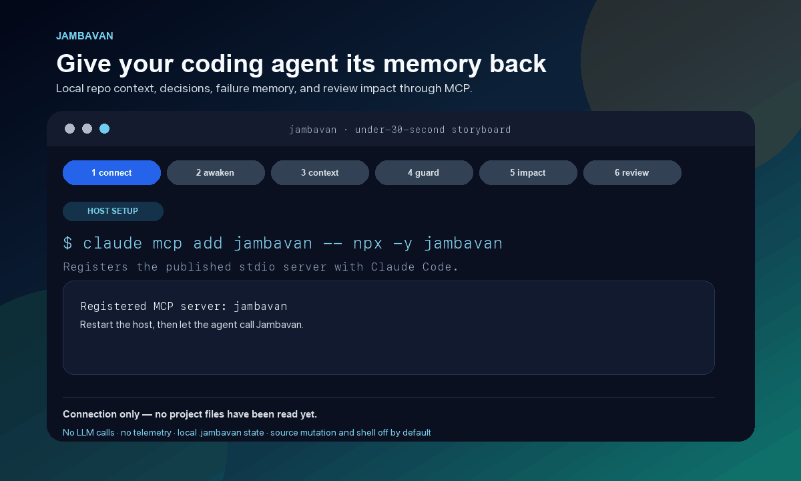
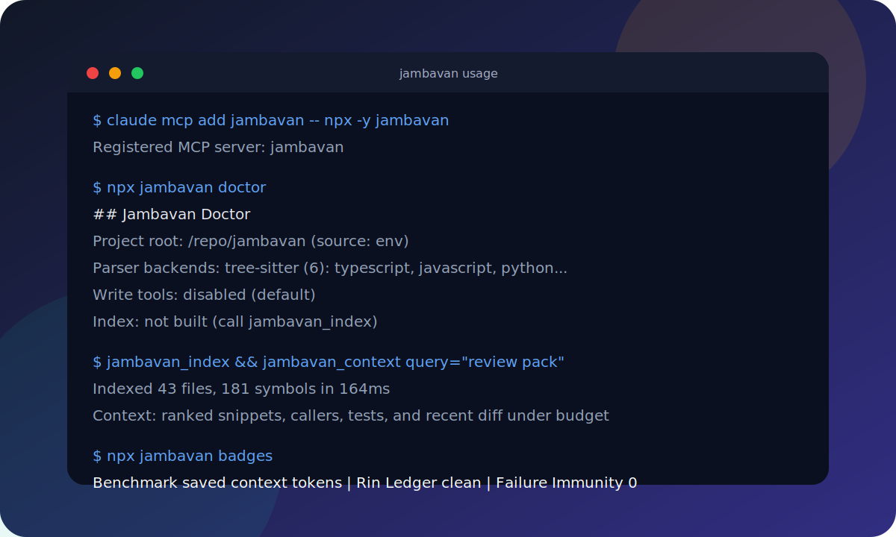

<h1 align="center">Jambavan</h1>

<p align="center"><em>Awaken your coding agent's memory, repo awareness, and review judgment.</em></p>

<p align="center">
  <a href="https://www.npmjs.com/package/jambavan"></a>
  <a href="https://nodejs.org"></a>
  <a href="https://github.com/beingmartinbmc/jambavan/commits/main"></a>
  <a href="https://github.com/beingmartinbmc/jambavan/actions/workflows/ci.yml"></a>
  <a href="https://bundlephobia.com/package/jambavan"></a>
  <a href="https://www.npmjs.com/package/jambavan"></a>
  <a href="./LICENSE"></a>
</p>

<p align="center">
  
</p>

## The Story

In the Ramayana, Hanuman already had immense strength, but he had forgotten it. At the edge of the ocean, when the impossible leap to Lanka had to be made, Jambavan did not give Hanuman a new power. He reminded him of the power he already had.

That is the use case for this project.

Modern coding agents can reason, edit, test, review, and debug. What they forget is the ground beneath them: what this repo contains, which symbols call which code, what the last session decided, which fixes already failed, and what a reviewer needs to know before trusting a change. Jambavan is the local-first MCP layer that reminds the agent. It awakens repo memory and codebase awareness before the next leap.

Use Jambavan when your agent:

- rereads entire files because it lacks a durable code index
- forgets decisions between sessions or between tools
- retries the same failed command or dead-end patch
- starts PR review from a raw file list instead of touched symbols, callers, tests, and risk
- needs compact, local context without uploading code or calling another LLM

## What It Is

Jambavan is a local-first [Model Context Protocol](https://modelcontextprotocol.io) server for Claude Code, Cursor, Codex, Continue, and any MCP client. It gives coding agents a state layer:

- **Codebase awareness** - AST-aware index, ranked context, callers, tests, recent diff, and a lightweight code graph.
- **Durable memory** - human-readable project memories under `.jambavan/memory/`.
- **Failure immunity** - searchable records of failed commands, root causes, and what not to retry.
- **Review packs** - branch-aware review context: touched files, symbols, callers, tests, `rin` debt, and past failures.
- **Prompt compression** - deterministic prose shortening that preserves code, paths, versions, and facts.
- **Local GUI** - browser graph view for symbols, relationships, debt, and failure hotspots.

No LLM calls. No telemetry. No code upload. Data stays local unless you explicitly move it.

## 30-Second Demo

```bash
claude mcp add jambavan -- npx -y jambavan
npx jambavan doctor
# In your MCP host: jambavan_awaken -> jambavan_index -> jambavan_context "where is auth handled?"
```

The model now has local repo context, previous decisions, and searchable failure history before it edits.

<p align="center">
  
</p>

<p align="center">
  
</p>

## Before / After

| Without Jambavan | With Jambavan |
|---|---|
| Agent rereads whole files and burns tokens. | Agent retrieves ranked symbols, callers, tests, and recent diff. |
| Decisions vanish between sessions. | Durable markdown memory survives across hosts and models. |
| Failed fixes get retried. | Failure records say what failed, why, and what not to retry. |
| PR review starts from raw changed files. | Review pack maps touched files to symbols, callers, tests, debt, and risk. |
| A new chat starts cold. | `jambavan_awaken` restores protocol, memories, and project context. |

## Works With

| Host | Setup |
|---|---|
| Claude Code | `claude mcp add jambavan -- npx -y jambavan` |
| Cursor | `.cursor/mcp.json` |
| Codex CLI | `codex mcp add jambavan -- npx -y jambavan` |
| Continue | `~/.continue/mcpServers/jambavan.json` |
| Any MCP client | command: `npx -y jambavan` |

## Install

One command. Finds Claude Code, Codex CLI, Cursor, and Continue on your machine. Registers Jambavan as an MCP server for each one it finds.

```bash
# macOS, Linux, WSL, Git Bash
curl -fsSL https://raw.githubusercontent.com/beingmartinbmc/jambavan/main/install.sh | bash
```

```powershell
# Windows, PowerShell 5.1+
irm https://raw.githubusercontent.com/beingmartinbmc/jambavan/main/install.ps1 | iex
```

Needs Node >=20. Safe to re-run. It skips agents you do not have and does not remove other MCP servers from your config. As with any internet shell script, read it before piping it into a shell.

## Manual Registration

Same MCP command everywhere: `npx -y jambavan`.

**Claude Code**

```bash
claude mcp add jambavan -- npx -y jambavan
```

**Codex CLI**

```bash
codex mcp add jambavan -- npx -y jambavan
```

**Cursor** (`~/.cursor/mcp.json` global, or `.cursor/mcp.json` per project)

```json
{
  "mcpServers": {
    "jambavan": { "command": "npx", "args": ["-y", "jambavan"] }
  }
}
```

**Continue** (`~/.continue/mcpServers/jambavan.json`)

```json
{ "command": "npx", "args": ["-y", "jambavan"] }
```

## First Run

After registering, ask your host model to run:

```text
jambavan_awaken
jambavan_doctor
jambavan_index
jambavan_watch start
```

`jambavan_doctor` checks project-root detection, parser backends, gates, memory paths, CI hints, and index/watcher status. If it reports a root such as `$HOME`, set `JAMBAVAN_ROOT` to one repo, reconnect, and run doctor again.

## The Powers

| Power | Tools | What it gives the agent |
|---|---|---|
| **Sight** | `jambavan_index`, `jambavan_context`, `jambavan_watch`, `jambavan_diagnostics`, `jambavan_doctor` | AST-backed symbol index, token-budgeted context, callers, tests, recent diff, root health, and live watching. |
| **Bridge** | `jambavan_graph_report`, `jambavan_graph_query`, `jambavan_graph_path` | Lightweight code graph built from extracted references, imports, calls, and name mentions. |
| **Memory** | `jambavan_memory_store`, `jambavan_memory_search`, `jambavan_memory_recall`, `jambavan_memory_mine_session`, `jambavan_memory_invalidate`, `jambavan_memory_delete`, `jambavan_memory_status` | Durable local markdown memory. Decisions survive across sessions and hosts. |
| **Failure immunity** | `jambavan_failure_store`, `jambavan_failure_search` | Structured failure records so the next session does not retry the same dead end. |
| **Session continuity** | `jambavan_session_export`, `jambavan_session_import` | Portable handoff docs for new chats, new tools, or teammates. |
| **Review pack** | `jambavan_review_pack` | Branch review context: touched symbols, callers, tests, `rin` debt, and past failures. |
| **Sankshipta** | `jambavan_sankshipta` | Deterministic prompt/prose compression while preserving code and facts. |
| **Vibhishana Niti** | `jambavan_vibhishana_niti`, `jambavan_rin_mochan` | Efficient senior-dev discipline and deliberate shortcut debt ledger. |
| **Counsel** | `jambavan_mool_kaaran`, `jambavan_praman`, `jambavan_yukti`, `jambavan_vibhaajan` | Root-cause investigation, verification gates, planning, and task decomposition. |
| **Hands** | `read_file`, `search`, `list_files`; opt-in `write_file`, `patch_file`, `bash` | Guarded project-root file/search/shell tools. Mutating and shell tools are disabled by default. |
| **Awakening** | `jambavan_awaken` | A session protocol that reminds the model what powers exist and when to use them. |

### Functional Aliases

The Ramayana names remain stable, but Jambavan also exposes English aliases for model recall and searchability:

| Alias | Canonical tool |
|---|---|
| `root_cause` | `jambavan_mool_kaaran` |
| `verify_gate` | `jambavan_praman` |
| `strategy_plan` | `jambavan_yukti` |
| `decompose_task` | `jambavan_vibhaajan` |
| `dev_rules` | `jambavan_vibhishana_niti` |
| `debt_ledger` | `jambavan_rin_mochan` |
| `compress_prompt` | `jambavan_sankshipta` |

## Real Outputs

`jambavan_context "review pack"` returns focused code spans instead of whole files:

```text
# Jambavan Context
query: review pack
budget: 8000 tokens

## src/tools/review-pack.ts: buildReviewPack
kind: function · score: 0.92
Uses git diff to list touched files, maps symbols from the index, adds callers via graph,
associated tests via test-map, and risk flags for rin debt / missing tests / failures.
```

`jambavan_review_pack` turns a branch into reviewer-ready context:

```text
# Jambavan Review Pack
Base: main
Touched files: src/mcp/server.ts, src/mcp/tool-aliases.ts

src/mcp/server.ts
- touched symbols: startServer, handleToolCall
- callers: dist/index.js -> startServer
- associated tests: test/tool-aliases.test.ts
- risk flags: write-gated tool alias; verify disabled-tool listing
```

CLI form for CI and PR comments:

```bash
npx jambavan review-pack --base origin/main --format json --max-files 200
```

JSON includes `touchedCount`, `analyzedCount`, `truncated`, `files[]`, `rinMarkers[]`, and `failures[]`. The bundled [`.github/workflows/jambavan-review.yml`](.github/workflows/jambavan-review.yml) renders it into one idempotent PR comment.

`jambavan_failure_search "timeout"` prevents repeat dead ends:

```text
FailureRecord: flaky auth test timeout
Root cause: unawaited promise in token refresh mock.
Do not retry: increasing the test timeout; it hid the race.
Next check: run the focused auth test with fake timers enabled.
```

## Recommended Workflow

1. `jambavan_awaken` - read the protocol and recent project memories.
2. `jambavan_index` - build the local AST-backed index.
3. `jambavan_watch start` - keep the index live while editing.
4. `jambavan_context` - pull ranked, token-budgeted context before touching unfamiliar code.
5. `root_cause` / `verify_gate` / `strategy_plan` when debugging, claiming completion, or planning multi-step work.
6. Run the smallest relevant check.
7. `jambavan_memory_store` or `jambavan_memory_mine_session` - persist decisions.
8. `jambavan_failure_store` - record dead ends with root cause and do-not-retry advice.
9. `jambavan_session_export` - hand off to the next session or teammate.

## Privacy And Safety

**No LLM calls. No telemetry. No code upload.** Jambavan stores indexes, cache, and memory under `.jambavan/` by default.

Read-only tools are on by default. Mutating and shell tools are not even advertised unless you opt in:

| Tool(s) | Enable with |
|---|---|
| `write_file`, `patch_file`, `jambavan_sankshipta` | `JAMBAVAN_ALLOW_WRITE=1` |
| `bash` | `JAMBAVAN_ALLOW_BASH=1` |

File, search, list, and shell working directories are confined to `JAMBAVAN_ROOT` or the detected project root. Set `JAMBAVAN_ALLOW_OUTSIDE_ROOT=1` only for trusted local use. Secret-looking files (`.env*`, `*.pem`, `*.key`, `id_rsa`, `.npmrc`, cloud credentials, and similar) are refused unless `JAMBAVAN_ALLOW_SECRETS=1`.

`bash` uses a minimal no-color environment and blocks a few obvious footguns such as `rm -rf /`, `git reset --hard`, `git clean -fx`, and blind `curl | sh`. This is not a security boundary. Treat it like a local shell and sandbox the workspace if you need real isolation.

## Troubleshooting

### GUI Apps And NVM

GUI-launched hosts such as Cursor often do not inherit your shell PATH. Symptoms: `spawn npx ENOENT`, or `env: node: No such file or directory`. Fix by running absolute `node` against npm's `npx-cli.js`, and set `PATH` explicitly.

Find paths:

```bash
command -v node
echo "$(npm prefix -g)/lib/node_modules/npm/bin/npx-cli.js"
```

Cursor config with NVM and npm-policy workarounds:

```json
{
  "mcpServers": {
    "jambavan": {
      "command": "/abs/path/to/node",
      "args": [
        "/abs/path/to/npm/bin/npx-cli.js",
        "-y",
        "--registry=https://registry.npmjs.org",
        "--before=",
        "jambavan@0.5.4"
      ],
      "env": { "PATH": "/abs/path/to/node/dir:/usr/bin:/bin" }
    }
  }
}
```

Claude Code `.claude.json` uses the same shape. Put npm policy overrides and the project root in `env` so reconnects do not fall back to an empty environment:

```json
{
  "mcpServers": {
    "jambavan": {
      "command": "/abs/path/to/node",
      "args": ["/abs/path/to/npm/bin/npx-cli.js", "-y", "jambavan@0.5.4"],
      "env": {
        "PATH": "/abs/path/to/node/dir:/usr/bin:/bin",
        "npm_config_registry": "https://registry.npmjs.org",
        "npm_config_min_release_age": "0",
        "JAMBAVAN_ROOT": "/abs/path/to/one/repo"
      }
    }
  }
}
```

In Claude Code this can show up as `-32000` / `failed to reconnect` because the MCP server process never started cleanly. Check MCP logs for the npm/PATH error.

### Root Confusion

Jambavan resolves the project root in this order: explicit `JAMBAVAN_ROOT`, MCP `roots/list` from the host, then a walk up from the server process cwd. Some hosts start MCP servers with `cwd=$HOME`; if they also do not answer `roots/list`, Jambavan can index too much.

Run `jambavan_doctor` or `npx jambavan doctor`. Healthy output should show the target repo with `source: env` or `source: client-roots`.

## Claude Code Plugin

This repo is also a Claude Code [plugin marketplace](https://code.claude.com/docs/en/plugin-marketplaces). Add it and install with two commands:

```shell
/plugin marketplace add beingmartinbmc/jambavan
/plugin install jambavan@jambavan
```

The plugin registers the same `npx -y jambavan` MCP server and bundles skills for using Jambavan, Vibhishana Niti, root-cause debugging, release checks, and strict review.

## Examples

- [Claude Code setup](examples/claude-code.md)
- [Cursor setup](examples/cursor.md)
- [Codex CLI setup](examples/codex.md)
- [Continue setup](examples/continue.md)
- [Review pack output](examples/review-pack.md)

## Direct CLI Commands

```bash
npm install
npm run build
node dist/index.js --help
node dist/index.js
```

Set `JAMBAVAN_ROOT=/path/to/project` when launching outside the target repo.

Useful one-shot commands:

```bash
npx jambavan doctor
npx jambavan review-pack --base origin/main --format json --max-files 200
npx jambavan html-handoff --out /tmp/handoff.html
npx jambavan daemon start
npx jambavan gui
npx jambavan badges
```

## Badges Command

`npx jambavan badges` prints three local markdown lines you can paste into a README:

```bash
npx jambavan badges
```

The lines summarize benchmark context-token savings for the current repo, Rin Ledger debt markers (`// rin:` comments), and Failure Immunity (`FailureRecord` memories in the default project scope). The command makes no network calls. If you want rendered badge images, use a [shields.io static badge](https://shields.io/badges/static-badge) URL explicitly; README renders will then fetch from shields.io's CDN.

## Memory Bridge

`jambavan bridge` converts Jambavan memories to or from a portable MemPalace-shaped markdown folder tree. No network call, ever.

```bash
npx jambavan bridge --to mempalace [--out <dir>] [--scope <scope>]
npx jambavan bridge --from mempalace [--in <dir>]
```

`--to mempalace` writes one file per memory under `<dir>/<wing>/<room>/<title>.md`. Hand that tree to a host model and ask it to file drawers with MemPalace tools. `--from mempalace` imports the same shape back into Jambavan.

## PR And Session Handoffs

`npx jambavan handoff --write-pr-template` injects the same handoff card as `jambavan_session_export` into `.github/pull_request_template.md`, creating the file if needed. Re-running replaces the old block in place.

```bash
npx jambavan handoff --write-pr-template [--scope <scope>]
npx jambavan handoff --write-pr-template --post
```

`--post` shells out to your authenticated `gh pr comment`, so it is opt-in and has the same trust boundary as the `bash` tool.

`npx jambavan html-handoff` writes a self-contained HTML report for humans: memory timeline, rin debt, indexed-symbol stats, dirty files, recent commits, collapsible sections, and copy buttons.

## Background Daemon

`npx jambavan daemon start` runs the same watcher used by `jambavan_watch` in a detached background process. It writes `.jambavan/daemon.pid` and `.jambavan/daemon.log`.

```bash
npx jambavan daemon start
npx jambavan daemon status
npx jambavan daemon stop
```

This mainly helps long-lived terminal or CI workflows where no MCP host keeps the index warm between tool calls.

## GUI Visualizer

`npx jambavan gui` indexes the project and serves a dependency-free local page over Node's built-in `http`, bound to `127.0.0.1` only.

```bash
npx jambavan gui
npx jambavan gui --port 5000
npx jambavan gui --no-open
```

The page has three tabs: code graph, Rin Debt, and Failures. It includes search, pan/zoom, heat markers, and click-through source/caller/callee details. All data comes from local JSON endpoints.

<p align="center">
  
</p>

## Configuration

| Env var | Default | Description |
|---|---|---|
| `JAMBAVAN_ROOT` | auto-detect | Project root to index and serve |
| `JAMBAVAN_MEMORY_HOME` | `<indexDir>/memory` | Where memory docs live |
| `JAMBAVAN_TOKEN_BUDGET` | `8000` | Max tokens in `jambavan_context` output |
| `JAMBAVAN_DEV_MODE` | `full` | Default Vibhishana Niti level (`lite`, `full`, `ultra`) |
| `JAMBAVAN_ALLOW_WRITE` | off | Registers `write_file`, `patch_file`, and `jambavan_sankshipta` |
| `JAMBAVAN_ALLOW_BASH` | off | Registers `bash` |
| `JAMBAVAN_ALLOW_OUTSIDE_ROOT` | off | Allows tools outside the project root |
| `JAMBAVAN_ALLOW_SECRETS` | off | Allows file tools to touch secret-looking files |
| `JAMBAVAN_BASH_INHERIT_ENV` | off | Passes full host env to `bash` |
| `JAMBAVAN_MAX_OUTPUT_CHARS` | `100000` | Global cap on tool output |
| `JAMBAVAN_MAX_READ_BYTES` | `5242880` | Max file size `read_file` loads |

## Benchmark

`npm run bench` dogfoods the real pipeline: deterministic, local-only, no LLM calls, no embeddings, no external services. It derives queries from the repo's own symbols and measures index speed, context token savings, graph extraction, prompt compression, and MCP tool latency.

Fresh run against this repo before the latest release:

| Dimension | Result |
|---|---|
| Cold index | about 150 ms for this repo |
| Warm re-index | about 5x faster than cold |
| Context tokens saved | about 40 percent on local benchmark queries |
| Tool latency | in-process tools are sub-millisecond; shell/disk tools dominate |
| Package dry run | `jambavan-0.5.4.tgz`, about 450 kB |

Run it on your repo:

```bash
JAMBAVAN_ROOT=/path/to/your/repo npm run bench
node dist/benchmark.js --json
```

## Checks

```bash
npm run docs-check
npm run lint
npm run unit
npm run self-check
npm run tool-check
npm run coverage
npm run build
npm pack --dry-run
```

## Social Preview

This repo includes [`.github/social-preview.png`](.github/social-preview.png). Set it as the GitHub repository social preview under **Settings -> Social preview** so shares explain the project before anyone opens the README.

See [ARCHITECTURE.md](ARCHITECTURE.md) for internals.

---

<p align="center"><sub>If Jambavan reminds your agent what it already knows before the next leap, star the repo so more MCP users find local-first tooling.</sub></p>
